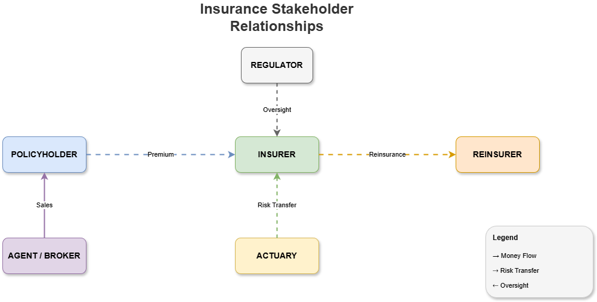

# 01.1 What is Insurance?

## Definition

Insurance is a **risk transfer mechanism** where an individual or entity (policyholder) pays a premium to an insurance company (insurer) in exchange for financial protection against potential future losses.

## Core Principles

| Principle | Description |
|-----------|-------------|
| **Utmost Good Faith** | Both parties must disclose all material facts |
| **Insurable Interest** | Policyholder must have financial stake in the insured |
| **Indemnity** | Compensation limited to actual loss (non-life) |
| **Subrogation** | Insurer's right to recover from third party |
| **Contribution** | Multiple insurers share the loss proportionally |
| **Proximate Cause** | Nearest cause of loss determines coverage |

## Key Stakeholders

| Stakeholder | Role | Responsibilities |
|-------------|------|------------------|
| **Insurer** | Insurance company | Risk assessment, policy issuance, claims payment |
| **Policyholder** | Purchaser of insurance | Premium payment, claim submission, disclosure |
| **Agent/Broker** | Intermediary | Sales, customer service, policy servicing |
| **Underwriter** | Risk assessor | Risk evaluation, pricing, acceptance decisions |
| **Claims Adjuster** | Claims processor | Investigation, assessment, settlement |
| **Actuary** | Data analyst | Pricing models, reserve calculations |
| **Regulator** | Government body | Licensing, compliance, consumer protection |
| **Reinsurer** | Insurer of insurers | Risk sharing, capacity provision |

## Stakeholder Relationships Diagram



```
                              ┌─────────────┐
                              │  REGULATOR  │
                              └──────┬──────┘
                                     │ Oversight
                                     ↓
┌─────────────┐  Premium    ┌─────────────┐  Reinsurance  ┌─────────────┐
│ POLICYHOLDER│ ──────────→ │   INSURER   │ ────────────→ │  REINSURER  │
└─────────────┘             └─────────────┘               └─────────────┘
       ↑                          ↑
       │ Sales                    │ Risk Transfer
       │                          │
┌─────────────┐             ┌─────────────┐
│AGENT/BROKER │             │  ACTUARY    │
└─────────────┘             └─────────────┘
```

---

[← Back to Lesson](../README.md) | [Next: Value Chain →](../02-value-chain/README.md)
