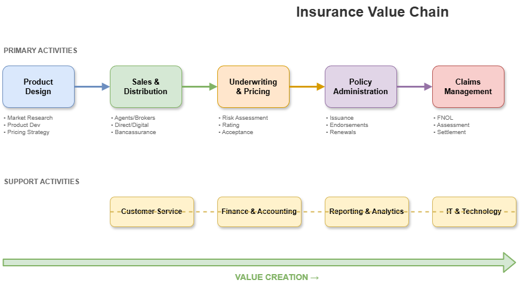

# 01.2 Insurance Value Chain

## Overview

The insurance value chain represents the end-to-end process of delivering insurance services, from product design to claims settlement.

## Value Chain Diagram



## Primary Activities

```
┌─────────────┐   ┌─────────────┐   ┌─────────────┐   ┌─────────────┐   ┌─────────────┐
│   Product   │ → │   Sales &   │ → │ Underwriting│ → │   Policy    │ → │   Claims    │
│   Design    │   │ Distribution│   │  & Pricing  │   │   Admin     │   │ Management  │
└─────────────┘   └─────────────┘   └─────────────┘   └─────────────┘   └─────────────┘
```

### 1. Product Design
- Market research and analysis
- Product development
- Pricing strategy
- Regulatory approval

### 2. Sales & Distribution
- Agent/broker networks
- Direct sales channels
- Digital platforms
- Bancassurance partnerships

### 3. Underwriting & Pricing
- Risk assessment
- Premium calculation
- Policy acceptance/decline
- Terms and conditions

### 4. Policy Administration
- Policy issuance
- Endorsements
- Renewals
- Cancellations

### 5. Claims Management
- First Notice of Loss (FNOL)
- Investigation
- Assessment
- Settlement

## Support Activities

```
┌─────────────┐   ┌─────────────┐   ┌─────────────┐   ┌─────────────┐
│  Customer   │   │  Finance &  │   │  Reporting  │   │     IT &    │
│   Service   │   │  Accounting │   │ & Analytics │   │  Technology │
└─────────────┘   └─────────────┘   └─────────────┘   └─────────────┘
```

| Activity | Functions |
|----------|-----------|
| **Customer Service** | Inquiries, complaints, policy changes |
| **Finance & Accounting** | Premium accounting, reserves, commissions |
| **Reporting & Analytics** | Regulatory reports, management dashboards |
| **IT & Technology** | Systems, infrastructure, digital capabilities |

---

[← Previous: What is Insurance](../01-what-is-insurance/README.md) | [Next: Business Model →](../03-business-model/README.md)
